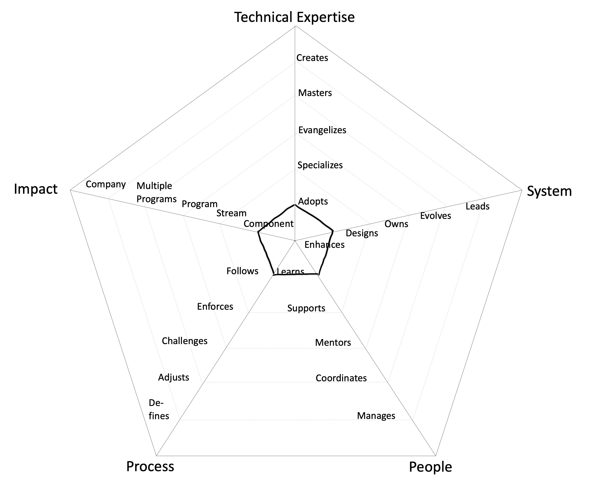
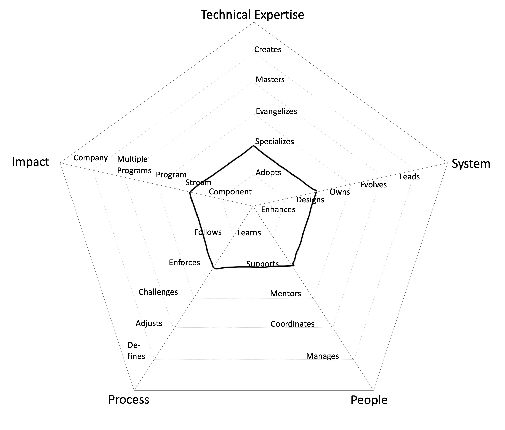
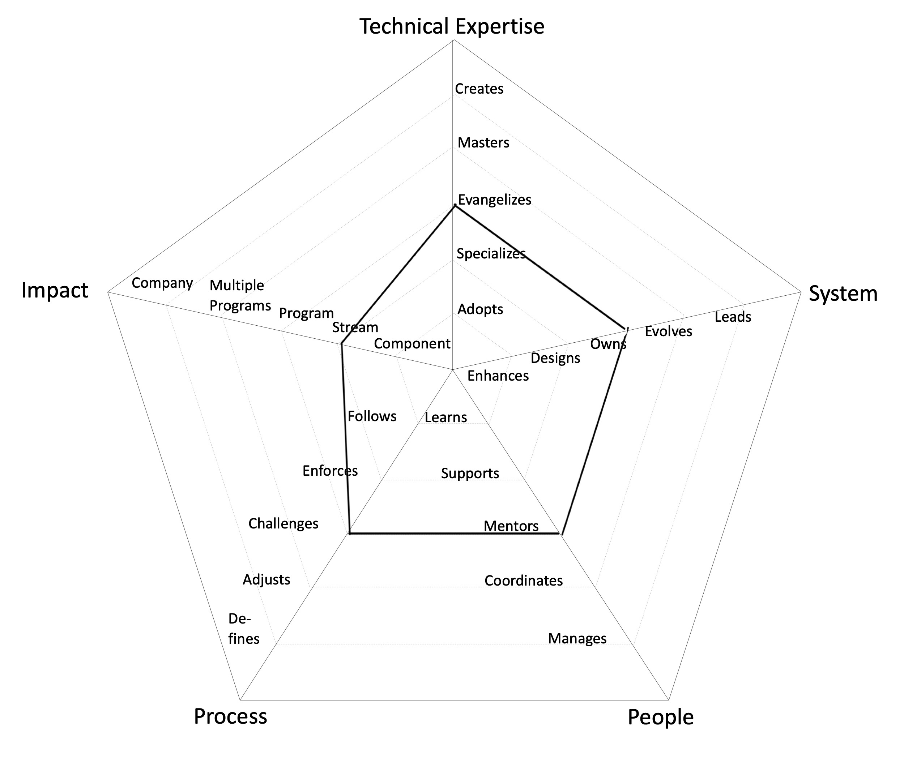
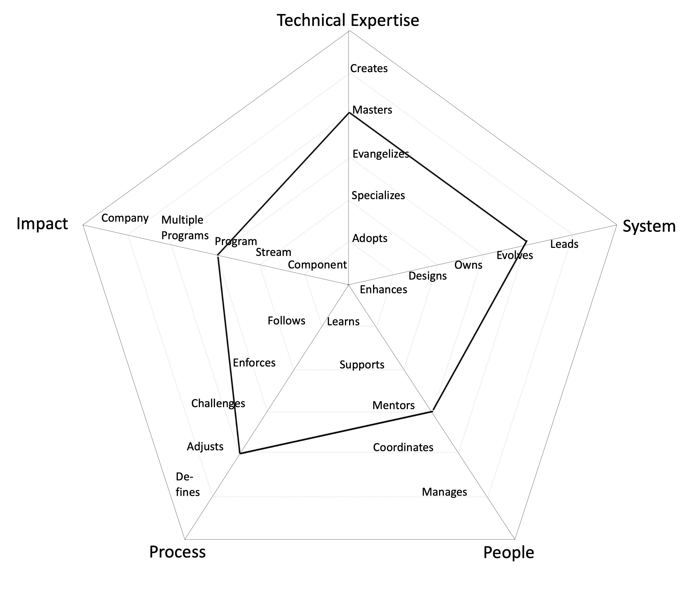
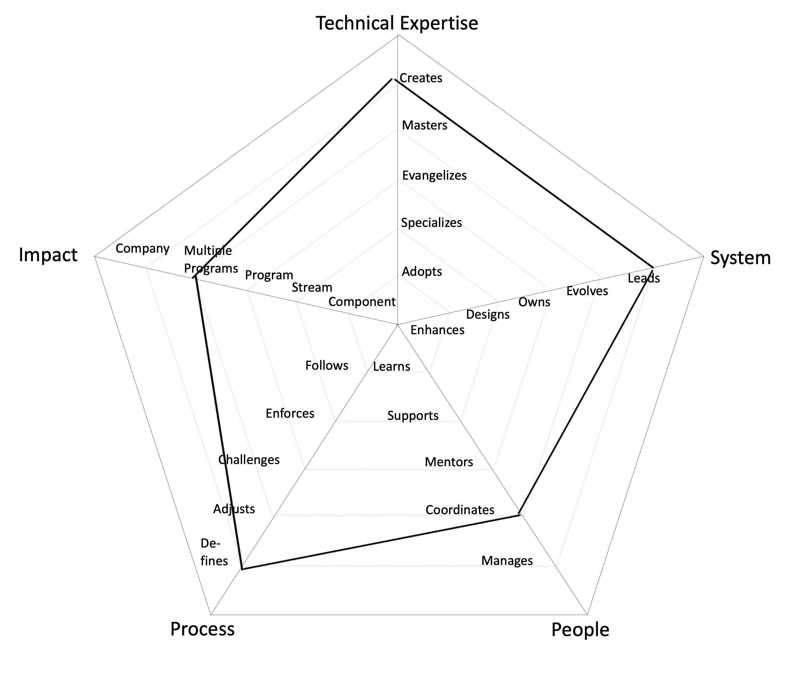

# Engineering Roles

## Associate Engineer

- **Impact** → **Component**: makes an impact on one or more components of the system
- **Technical Expertise** → **Adopts**: actively learns and adopts the architectural approaches and tools defined by the Stream
- **System** → **Enhances**: successfully pushes new features and bug fixes to improve and extend the system
- **People** → **Learns**: quickly learns from others and consistently steps up when it is required
- **Process** → **Follows**: follows the SDLC processes on a Stream level, delivering a consistent flow of features to production

---

## Engineer

- **Impact** → **Stream**: makes an impact on the whole Stream, not just on specific parts of it
- **Technical Expertise** → **Specializes**: is the go-to person for one or more architecture domains and takes initiative to learn new ones
- **System** → **Designs**: designs and implements medium to large size features while reducing the system's tech debt
- **People** → **Supports**: proactively supports other team members and helps them to be successful
- **Process** → **Enforces**: enforces the SDLC processes on a Stream level, making sure everybody understands the benefits and trade offs

---

## Senior Engineer

- **Impact** → **Stream**: makes an impact on the whole Stream, not just on specific parts of it
- **Technical Expertise** → **Evangelizes**: researches, creates proofs of concept and introduces new architectural approaches to the Stream
- **System** → **Owns**: owns the production operation and monitoring of the system and is aware of its SLAs
- **People** → **Mentors**: mentors others to accelerate their career-growth and encourages them to participate
- **Process** → **Challenges**: challenges the SDLC processes on a Stream level, looking for ways to improve them

---

## Principal Engineer

- **Impact** → **Program (Multiple Streams)**: makes an impact not only their Stream but also on other Streams in the same or other Programs
- **Technical Expertise** → **Masters**: has very deep knowledge about the whole tech stack of the system
- **System** → **Evolves**: evolves the architecture to support future requirements and defines its SLAs
- **People** → **Mentors**: mentors others to accelerate their career-growth and encourages them to participate
- **Process** → **Adjusts**: adjusts the SDLC processes on a Stream level and extends it to other Streams within a Program, listening to feedback and guiding the team through the changes

---

## Distinguished Engineer

- **Impact** → **Multiple Programs**: makes an impact on more than one Programs
- **Technical Expertise** → **Creates**: designs and creates new architecture parts that are widely used either by the Streams within or outside the Program
- **System** → **Leads**: leads the technical excellence of the system and creates plans to mitigate outages
- **People** → **Coordinates**: coordinates team members providing effective feedback and moderating discussions
- **Process** → **Defines**: defines the right processes for the Program maturity level, balancing agility and discipline

