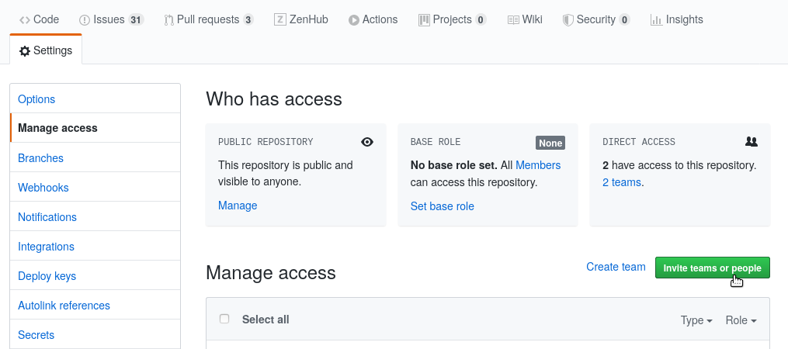
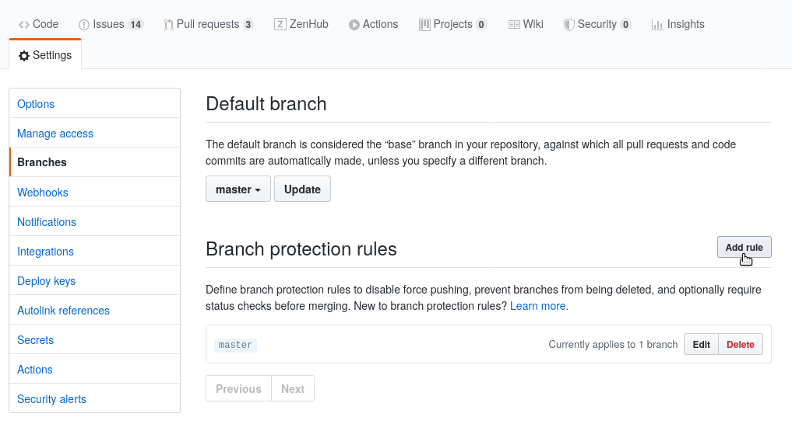
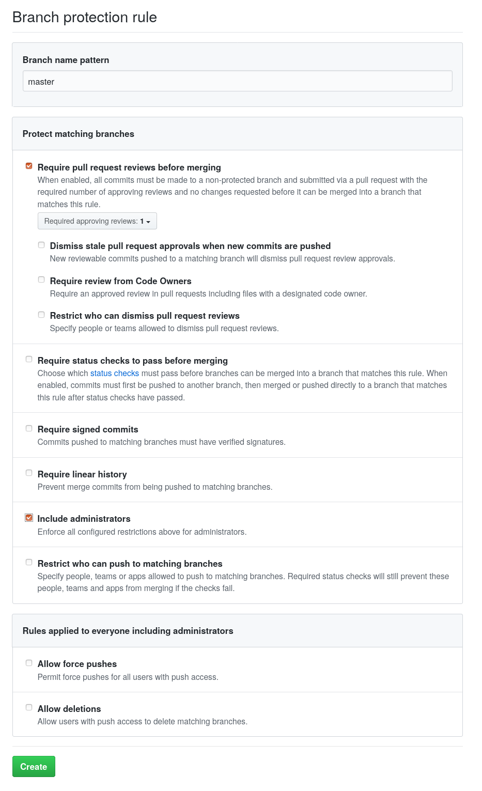
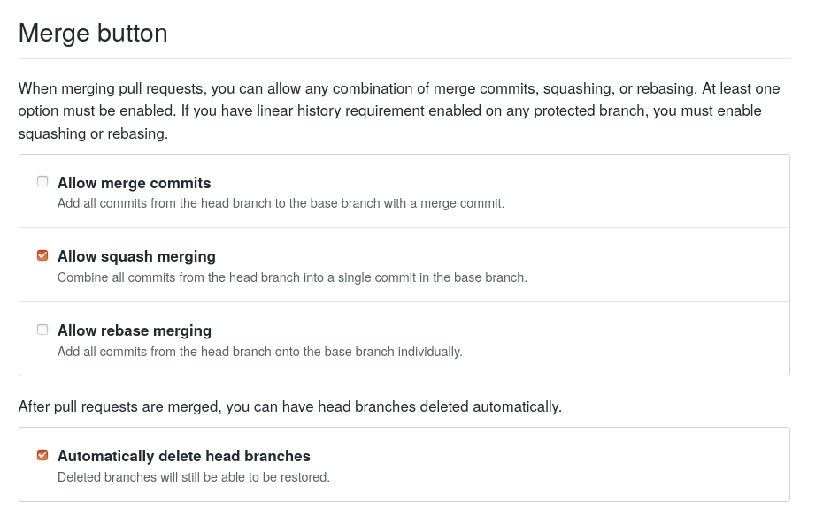

# Repo Setup Guide

These are steps to setup a new repo under the ChainSafe Github organization:

# Project Creation

1. Create the project in the ChainSafe organization on Github
    1. If you do not have permission reach out to @David Ansermino, @Greg Markou or @Priom Chowdhury 

# Setup Team Permissions

1. Go to `Settings` → `Manage Access`. 
2.  Add the team and give them **Write** permissions. Avoid inviting individuals, there should be a team on the organization that has everyone working on the project. 
    1. If the team or the admin team doesn't exist, please reach out to @David Ansermino, @Greg Markou or @Priom Chowdhury  

3. Add the admin team (should be "<team-name>-admin") and give them **Admin** permissions

# Branch Protection

1. Goto `Settings` → `Branches`
2. If this is a new repo, choose `Add Rule`. In this example you can see a rule already exists for `master` branch, in which case you can select `Edit` to modify it. 

3. These are the base requirements to ensure at least 1 review is required to merge PRs.

Some additional options:

- **Branch name pattern**: some projects use different branch names. `master` is usually the default branch, but rules may also need to applied to a `develop` or `release` branch
- **Required approving reviews**: this can be increased to a number that makes sense for the team size. This is usually 1-3 for most repos.
- **Require status checks to pass before merging**: this should be enabled if CI (eg. Travis, CircleCI) is used in the repo.

# Disable Merge Commits & Rebase

1. Goto `Settings`  and scroll down to `Merge button`

    

2. Disable `Allow merge commits` and `Allow rebase merging`. Since most repos use *squash merging* this prevents anyone from accidentally using one of the other options. If the TL has reason to override this they may certainly do so.

3. Enable `Automatically delete head branches`. This automatically deletes branches once they are merged to help keep the repo organized.

# Basic Readme

Please see other ChainSafe repos for examples of what to include. 

Gossamer: [https://github.com/chainsafe/gossamer](https://github.com/chainsafe/gossamer)

Forest: [https://github.com/chainsafe/forest](https://github.com/chainsafe/forest)

Lodestar: [https://github.com/ChainSafe/lodestar/](https://github.com/ChainSafe/lodestar/)

# License

A license file must be added to the root of the repo in a file named `LICENSE`. Github will automatically pick this up and display it. It's recommended to also ensure the source code of the repo has matching license headers. Please reach out to @David Ansermino for more details. 

# Continuous Integration

A continuous integration (CI) service must be setup before code is committed. We strongly advise using Travis-ci, Github Actions, or CircleCi, respectively. Even though you may not know what the repository setup structure may resemble, you will know the basic language that will be used, therefore the most simple CI can be setup:

1. Include the linter
2. Include your test runner
3. If possible, add a build step

# CLA

Please use [https://cla-assistant.io/](https://cla-assistant.io/)

# Code Owners

Depending on the project, it might make sense to add a code owners file. Please reference the [github guide](https://help.github.com/en/github/creating-cloning-and-archiving-repositories/about-code-owners) for more information.

# License Checker

tbd

# Review

Once everything has been done, and setup, reach out to @David Ansermino or @Greg Markou to double check that everything is setup accordingly.

Good morning y'all!
