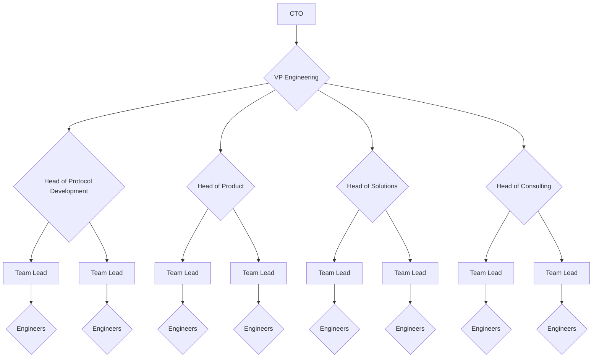

# Departments

ChainSafe's engineering consists of 4 departments (Consulting, Products, Protocols, Solutions). Each department is focusing
on different parts of the ChainSafe business and has a slightly different way of doing things.
You can read more about each of them in the following sections.

## Engineering Reporting Structure

Every Engineer reports to a Team Lead. All Team Leads report to a Head of Engineering. There are several Head of Engineering positions that have discrete domains (e.g. Head of Protocol Implementations, Head of Engineering, General Consulting). All Heads of Engineering report to the VP of Engineering who reports to the CTO. All Team Leads, Heads of Engineering and the VP of Engineering are on the Engineering Management career track.

Keep in mind this only defines the reporting structure and not the functional interactions with the organization.

