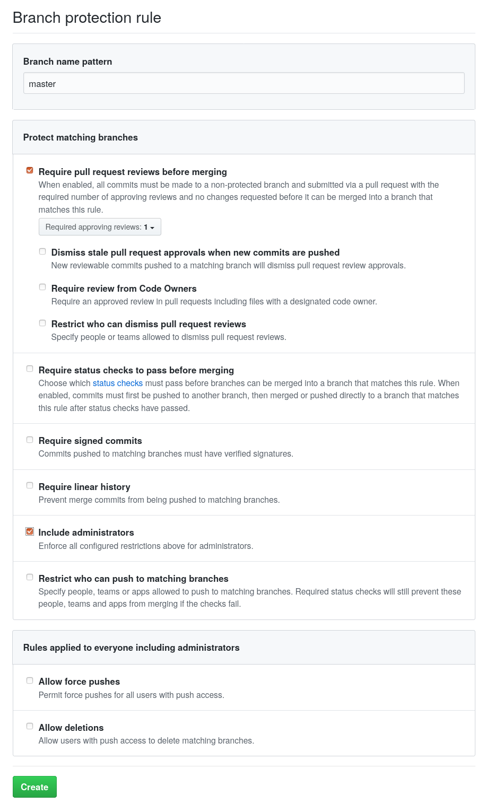
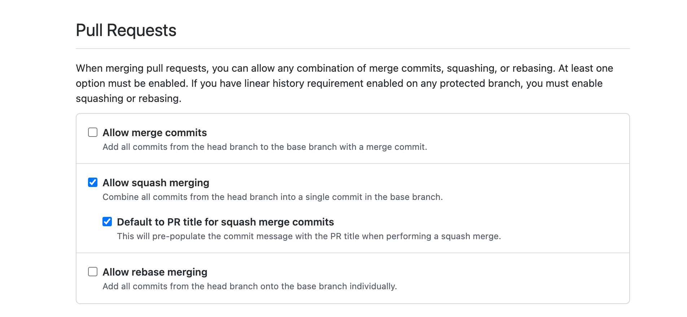

# Setup GitHub Repository

These are steps to setup a new repository under the ChainSafe GitHub organization:

:::info
The org owners are now the Heads of Engineering and they can assist you with any changes you require.
:::

## Project Creation

1. Create the project in the ChainSafe organization on GitHub
    1. If you do not have permission reach out to an org owner (see note above).

## Setup Team Permissions

1. Go to `Settings` → `Manage Access`. 
2. Add the team and give them **Write** permissions. Avoid inviting individuals, there should be a team on the organization that has everyone working on the project. 
    1. If the team or the admin team doesn't exist, please reach out to an org owner (see note above)


3. Add the admin team (should be `<team-name>-admin`) and give them **Admin** permissions

4. Add the **ChainSafe** team with `Read` permissions

- Note: Adding the **ChainSafe** team will give access to the entire org. If the project is sensitive consider not including this team.

## Branch Protection

1. Goto `Settings` → `Branches`
2. If this is a new repository, choose `Add Rule`. In this example you can see a rule already exists for `master` branch, in which case you can select `Edit` to modify it. 


3. These are the base requirements to ensure at least 1 review is required to merge Pull Requests.



Some additional options:

- **Branch name pattern**: some projects use different branch names. `main` is usually the default branch, but rules may also need to applied to a `develop` or `release` branch
- **Required approving reviews**: this can be increased to a number that makes sense for the team size. This is usually 1-3 for most repositories.
- **Require status checks to pass before merging**: this should be enabled if CI (eg. GitHub Actions) is used in the repository.

## Disable Merge Commits & Rebase

1. Goto `Settings` and scroll down to `Merge button`
    
    
    

2. Disable `Allow merge commits` and `Allow rebase merging`. Since most repositories use *squash merging* this prevents anyone from accidentally using one of the other options. If the TL has reason to override this they may certainly do so.

3. Enable `Automatically delete head branches`. This automatically deletes branches once they are merged to help keep the repository organized.

## Basic README

Please see other ChainSafe repositories for examples of what to include. 

Gossamer: [https://github.com/chainsafe/gossamer](https://github.com/chainsafe/gossamer)

Forest: [https://github.com/chainsafe/forest](https://github.com/chainsafe/forest)

Lodestar: [https://github.com/ChainSafe/lodestar/](https://github.com/ChainSafe/lodestar/)

## License

A license file must be added to the root of the repository in a file named `LICENSE`. GitHub will automatically pick this up and display it. It's recommended to also ensure the source code of the repository has matching license headers. Please reach out to `David Ansermino` for more details. 

## Continuous Integration

A continuous integration (CI) service must be setup before code is committed. We strongly advise using GitHub Actions. Even though you may not know what the repository setup structure may resemble, you will know the basic language that will be used, therefore the most simple CI can be setup:

1. Include the linter
2. Include your test runner
3. If possible, add a build step

You should use recommended CI for your programming language which can be found at [Tech Stack](../2_tech-stack/_category_.yml)

## CLA

Please use [https://cla-assistant.io/](https://cla-assistant.io/). This will be automatically enabled for all public repositories in the org (status check needs to be required).

## Code Owners

Depending on the project, it might make sense to add a code owners file. Please reference the [GitHub guide](https://help.github.com/en/github/creating-cloning-and-archiving-repositories/about-code-owners) for more information.

## License Checker

[WIP]

## Review

Once everything has been done, and setup, reach out to your Head of Engineering person to double check that everything is setup accordingly.

## Labels

<details>
    <summary>Click to see labels and their meaning</summary>

### Status

Status: Breaking Change

- Added to a PR or issue that would cause a breaking change

Status: Abandoned

- Added to a PR or issue is no longer being actively pursued.

Status: Approved

- Added to a PR when the required number of approvals have been met.

Status: Blocked

- Added to issues and Pull Requests when work can not be continued until another task is completed.

Status: In Progress

- Added to issues to signal that its actively being worked on.

Status: Do not merge

- Added to Pull Requests that are not allowed to be merged.

Status: On Ice

- Added to issues and Pull Requests that are considered important but no longer pursued for the near future.

Status: Review Needed

- Added to Pull Requests that need the maintainer(s) to review.

Status: Changes Requested

- Added to Pull Requests that require further changes from the contributor.

Status: Stale

- Added to issues and Pull Requests if they have not received enough activity.

Status: Needs Clarification

- Added to issues that are not clearly understood, and require additional input.

### Types

Type: Feature

- Added to issues and Pull Requests to identify that the change is a new feature.

Type: Epic

- Added to issues to encompass many different types of issues together

Type: Bug

- Added to issues and Pull Requests if they are addressing a bug

Type: Enhancement

- Added to issues and Pull Requests when a change includes improvements or optimizations.

Type: Maintenance

- Added to issues and Pull Requests when a change is for repository maintenance, such as CI or linter changes.

Type: Question

- Added to issues that are general discussion questions, and don't offer bug reports etc..

Type: Documentation

- Added to issues or Pull Requests that relate to the project wiki, or documentation.

### Priority Levels

Priority: P0

- Added to issues and Pull Requests relating to a critical severity bugs.

Priority: P1

- Added to issues and Pull Requests relating to a high severity bugs.

Priority: P2

- Added to issues and Pull Requests relating to a medium severity bugs.

Priority: P3

- Added to issues and Pull Requests relating to a low severity bugs.

</details>

## Slack notifications
<details>
  <summary>Optional! Click to see.</summary>

### Overview

There are two methods for receiving various notifications from GitHub via Slack.

- **Scheduled Reminders**: These allow you receive reminders at some interval about pending PRs on specific repositories in a Slack channel.
- **Slackbot Notifications**: Enabling these will cause actions on GitHub to trigger notifications on Slack.

### Slackbot Notifications

The instructions for configuring the GitHub Slackbot can be found here: [https://github.com/integrations/slack#configuration](https://github.com/integrations/slack#configuration)

A common configuration follows these steps:

```yaml
/github subscribe owner/repository
/github subscribe owner/repository reviews comments
```

You can check which features are enabled in a channel with:

```yaml
/github subscribe list features
```
</details>


## Scheduled Reminders

Scheduled Reminders can be configured at the org level or the team level. It is recommend that you use the team level, as this allows team maintainers to setup and maintain them.

Instructions for how to configure team level reminders can be found here: 

[Managing scheduled reminders for your team - GitHub Docs](https://docs.github.com/en/organizations/organizing-members-into-teams/managing-scheduled-reminders-for-your-team)


Good morning y'all!