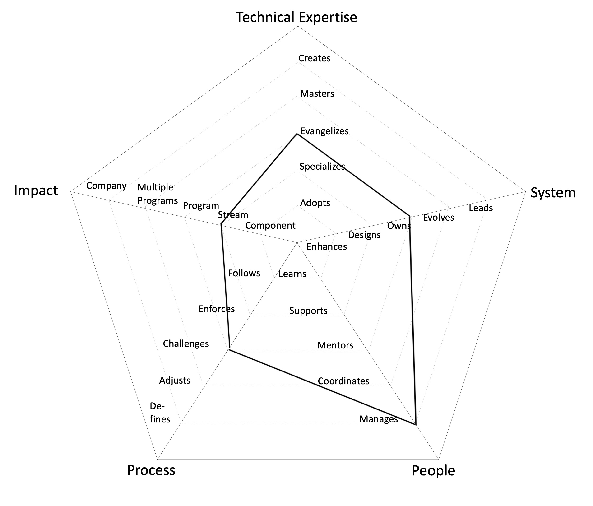
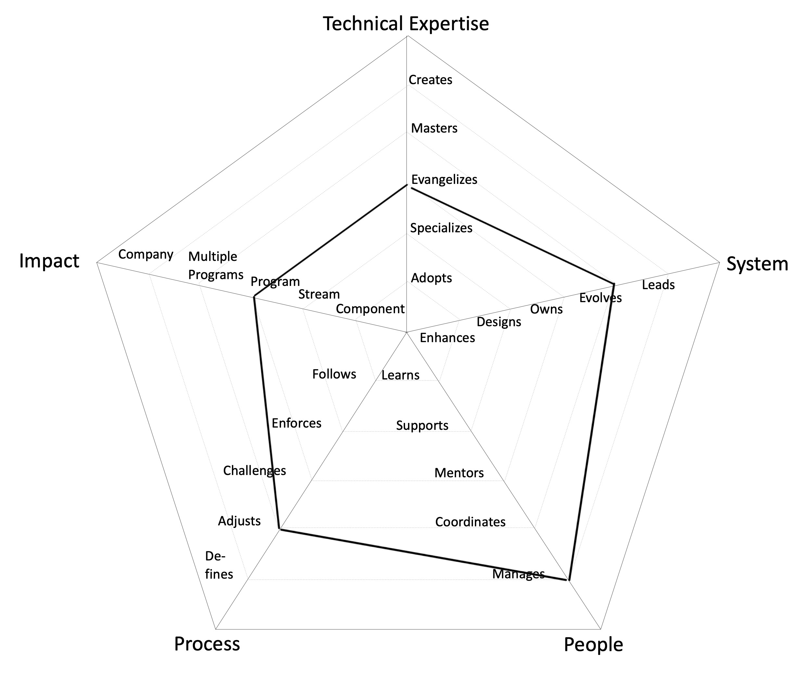
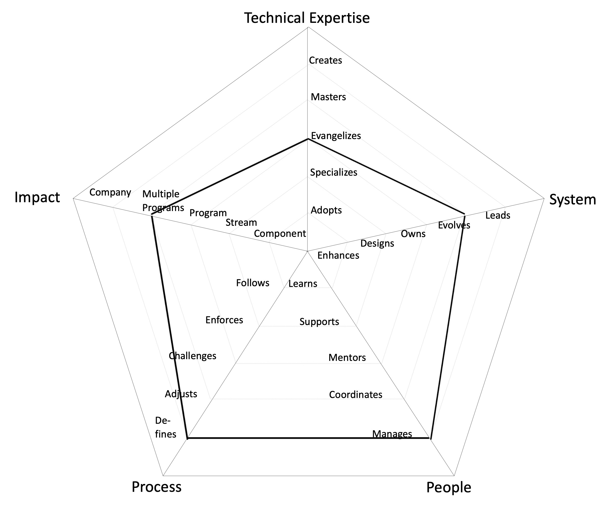

# Engineering Manager Roles

## Engineering Manager

- **Stream**: makes an impact on the whole Stream, not just on specific parts of it
- **Evangelizes**: researches, creates proofs of concept and introduces new architectural approaches to the Stream
- **Owns**: owns the production operation and monitoring of the system and is aware of its SLAs
- **Manages**: manages the team members’ career, expectations, performance and level of happiness
- **Challenges**: challenges the SDLC processes on a Stream level, looking for ways to improve them
---

## Senior Engineering Manager

- **Program**: makes an impact not only their Stream but also on other Streams in the Program
- **Evangelizes**: researches, creates proofs of concept and introduces new architectural approaches to the Stream
- **Evolves**: evolves the architecture to support future requirements and defines its SLAs
- **Manages**: manages the team members’ career, expectations, performance and level of happiness
- **Adjusts**: adjusts the SDLC processes on a Stream level and extends it to other Streams within a Program, listening to feedback and guiding the team through the changes

---

## Engineering Head

- **Multiple Programs**: makes an impact on more than one Programs
- **Evangelizes**: researches, creates proofs of concept and introduces new architectural approaches to the Stream
- **Evolves**: evolves the architecture to support future requirements and defines its SLAs
- **Manages**: manages the team members’ career, expectations, performance and level of happiness
- **Defines**: defines the right processes for the Program maturity level, balancing agility and discipline

---
