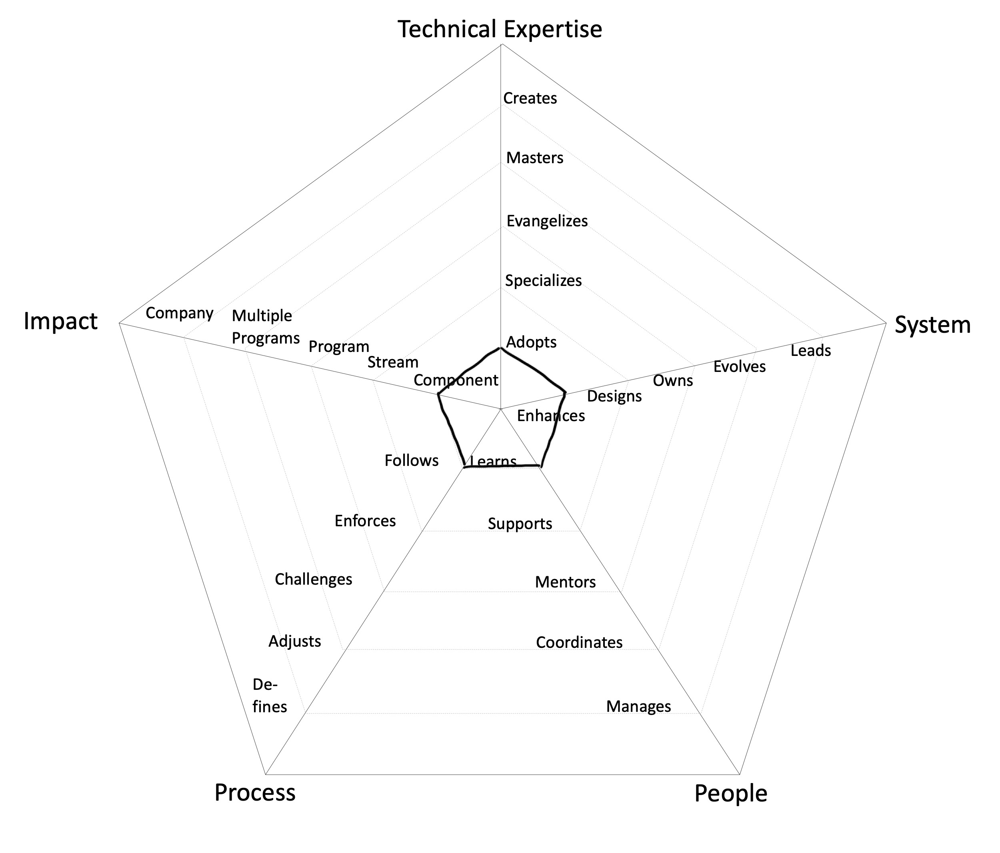
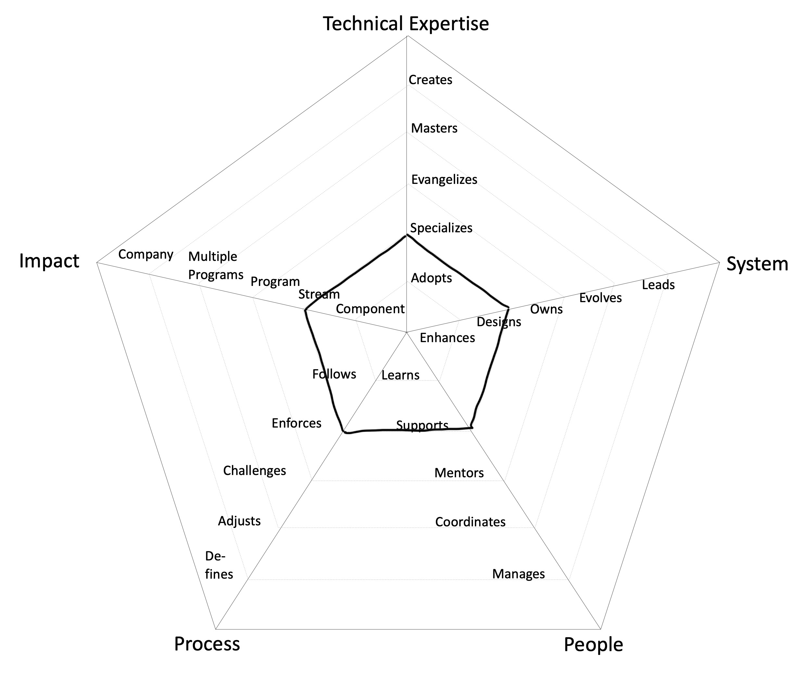
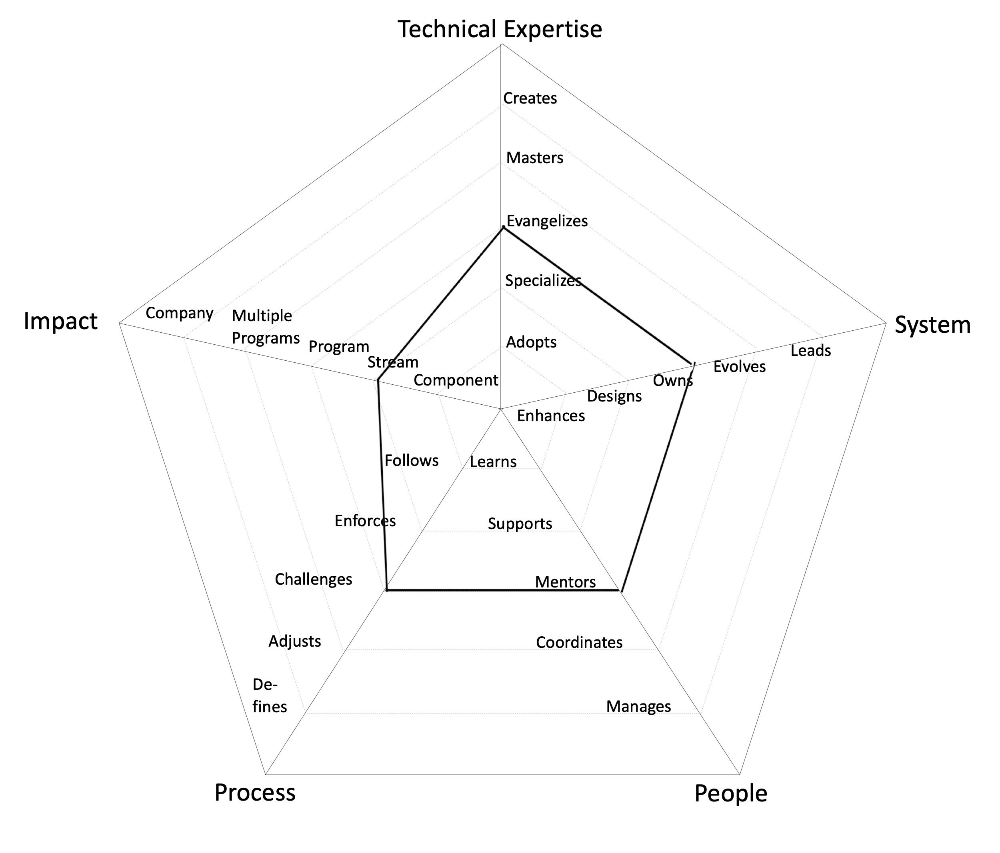
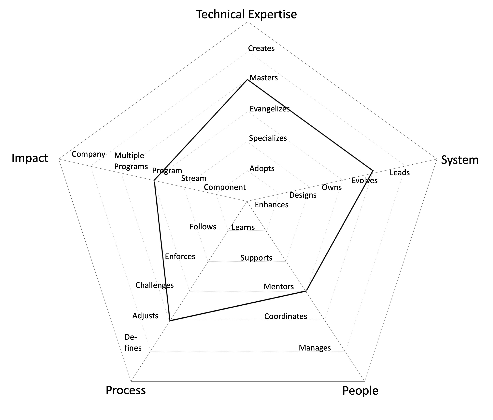
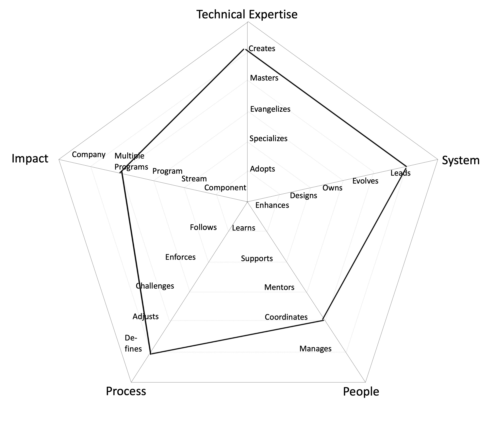

# Engineering Roles

## Associate Engineer
- Impact ➡ Component: makes an impact on one or more components of the system
- Technical Expertise ➡ Adopts: actively learns and adopts the architectural approaches and tools defined by the Stream
- System ➡ Enhances: successfully pushes new features and bug fixes to improve and extend the system
- People ➡ Learns: quickly learns from others and consistently steps up when it is required
- Process 
➡ Follows: follows the SDLC processes on a Stream level, delivering a consistent flow of features to production

---

## Engineer
- Impact ➡ Stream: makes an impact on the whole Stream, not just on specific parts of it
- Technical Expertise ➡ Specializes: is the go-to person for one or more architecture domains and takes initiative to learn new ones
- System ➡ Designs: designs and implements medium to large size features while reducing the system’s tech debt
- People ➡ Supports: proactively supports other team members and helps them to be successful
- Process 
➡ Enforces: enforces the [SDLC](#glossary) processes on a Stream level, making sure everybody understands the benefits and trade offs

---

## Senior Engineer
- Impact ➡ Stream: makes an impact on the whole Stream, not just on specific parts of it
- Technical Expertise ➡ Evangelizes: researches, creates proofs of concept and introduces new architectural approaches to the Stream
- System ➡ Owns: owns the production operation and monitoring of the system and is aware of its SLAs
- People ➡ Mentors: mentors others to accelerate their career-growth and encourages them to participate
- Process 
➡ Challenges: challenges the SDLC processes on a Stream level, looking for ways to improve them

---

## Principal Engineer
- Impact ➡ Program: makes an impact not only their Stream but also on other Streams in the Program
- Technical Expertise ➡ Masters: has very deep knowledge about the whole tech stack of the system
- System ➡ Evolves: evolves the architecture to support future requirements and defines its SLAs
- People ➡ Mentors: mentors others to accelerate their career-growth and encourages them to participate
- Process 
➡ Adjusts: adjusts the SDLC processes on a Stream level and extends it to other Streams within a Program, listening to feedback and guiding the team through the changes

---

## Distinguished Engineer

- Impact ➡ Multiple Programs: makes an impact on more than one Programs
- Technical Expertise ➡ Creates: designs and creates new architecture parts that are widely used either by the Streams within or outside the Program
- System ➡ Leads: leads the technical excellence of the system and creates plans to mitigate outages
- People ➡ Coordinates: coordinates team members providing effective feedback and moderating discussions
- Process 
➡ Defines: defines the right processes for the Program maturity level, balancing agility and discipline

---
