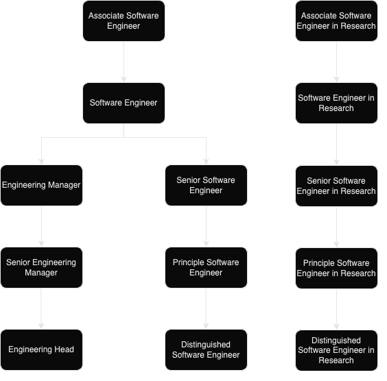

# Career Development

We want everyone at ChainSafe to have a sense of how they can grow and challenge themselves. From a career perspective, this means providing a clear sense of how an employee can progress within the organization. To facilitate this within Engineering, we have defined Engineering Ladders Framework (see [Acknowledgments](#acknowledgments) for more details).

This framework provides an outline for progression within the Engineering team at ChainSafe. It allows software engineering managers to have meaningful conversations with their direct reports around the expectations of each position and how to plan for the next level in their career ladder.
The framework relies heavily on radar charts to visually represent the different perspectives and expectations of a given position. At ChainSafe career progression we recognize 3 slightly different directions:

Each of this direction represents a sequence of roles and the attributes typically associated with each of these roles can be found [in Levels section](#levels).

Current roles progression assumes following roles:

 - [Engineering Roles](engineering)
 - [Research Roles](research)
 - [Engineering Management Roles](engineering-management)

Roles described here serve strictly as a reference and it is expected for each individual to have a unique shape on this chart. A promotion to the next ladder requires meeting ⅗ axes.

### Important note regarding level impact

While assigning levels to each axis make sure the meaning and definitions of selected levels are consistent. Each level on each axis is as important as the meaning of a whole character figure in the end.

**For example**: if somebody makes an Impact on a Stream level, they are already at least Evangelizing from the Technical Expertise perspective. Making a stream level impact means that this person already spreads some knowledge and influences others in the stream so they at least Evangelize.

## Levels

Currently we differentiate [two charts](charts) that describes levels for different functions. One chart relates to [Engineering](engineering) and another to [Research](research). [Engineering Management](engineering-management) career progression built with the Engineering chart and effectively relates to both functions.

Our engineering ladders have the following 5 axes (categories):
- **System**: scope of the impact on the technology, level of ownership of the system(s)
- **People**: relationship with the team(s)
- **Process**: level of engagement with the [SDLC](#glossary) process
- **Impact**: scope of the impact on the value delivery

For the Engineering verticals the 5th axis is:
- **Technical Expertise**: knowledge of the stack and tools being specialized

And for the Research the 5th axis is:
- **Research Methodology**: knowledge and ability to conduct a research

### Technical Expertise 
1. **Adopts**: actively learns and adopts the architectural approaches and tools defined by the Stream
2. **Specializes**: is the go-to person for one or more architecture domains and takes initiative to learn new ones
3. **Evangelizes**: researches, creates proofs of concept and introduces new architectural approaches to the Stream
4. **Masters**: has very deep knowledge about the whole tech stack of the system
5. **Creates**: designs and creates new architecture parts that are widely used either by the Streams within or outside the Program

### People
1. **Learns**: quickly learns from others and consistently steps up when it is required
2. **Supports**: proactively supports other team members and helps them to be successful
3. **Mentors**: mentors others to accelerate their career-growth and encourages them to participate
4. **Coordinates**: coordinates team members providing effective feedback and moderating discussions
5. **Manages**: manages the team members’ career, expectations, performance and level of happiness

### Process
1. **Follows**: follows the [SDLC](#glossary) processes on a Stream level, delivering a consistent flow of features to production
2. **Enforces**: enforces the [SDLC](#glossary) processes on a Stream level, making sure everybody understands the benefits and trade offs
3. **Challenges**: challenges the [SDLC](#glossary) processes on a Stream level, looking for ways to improve them
4. **Adjusts**: adjusts the [SDLC](#glossary) processes on a Stream level and extends it to other Streams within a Program, listening to feedback and guiding the team through the changes
5. **Defines**: defines the right processes for the Program maturity level, balancing agility and discipline

### Impact
1. **Component**: makes an impact on one or more components of the system
2. **Stream**: makes an impact on the whole Stream, not just on specific parts of it
3. **Program**: makes an impact not only their Stream but also on other Streams in the Program
4. **Multiple Programs**: makes an impact on more than one Programs
5. **Company**: makes an impact on most of the Programs

### System
:::info
Level of the [**Engineering Chart**](charts#engineering-chart)
:::
1. **Enhances**: successfully pushes new features and bug fixes to improve and extend the system
2. **Designs**: designs and implements medium to large size features while reducing the system’s tech debt
3. **Owns**: owns the production operation and monitoring of the system and is aware of its [SLAs](#glossary)
4. **Evolves**: evolves the architecture to support future requirements and defines its [SLAs](#glossary)
5. **Leads**: leads the technical excellence of the system and creates plans to mitigate outages

### Research Methodology
:::info
Level of the [**Research Chart**](charts#research-chart)
:::
1. **Executes**: Given a research question, knows where to look and gather all state-of-the-art articles and papers and summarize them with good coherency
2. **Analyzes**: Is able to filter out relevant and high quality papers, articles, projects. Can sufficiently critique the usefulness of the method. Can write longer articles on a topic explaining complex matters in simpler terms
3. **Proposes**: Can identify possible research directions, formulates research questions, scopes the research work with tangible outputs. Reviews the work of other team members with an eye for detail. Can write academic style papers, perform systematic literature review and publish it
4. **Leads**: Has the ability to foresee future impediments in any research undertaking. And if it is worth pursuing. Has a sufficient breadth of domain knowledge to facilitate cross-domain research. Leads and helps other team members develop a critical eye for the work
5. **Expands**: Pushes the boundaries of fundamental research throughout the community. Veteran and champion known in one or more research domains. Knows the process and importance of high impact publications

## Glossary
The following list contains brief explanations of the mentioned terms or subjects above in the document.

**Stream / Program / Multiple Programs** - more on [ChainSafe OS pages](https://www.notion.so/chainsafe/Core-Concepts-v1-0-1610247189c949fa9692de950518ac53)
For example: Forest is a stream. Protocol is a program.

**SDLC** - Software Development Life Cycle, including all the software stages

**SLA** - Service Level Agreement that outlines what exactly a service provider delivers to the customer (client)

## Acknowledgments
This framework is based on the open source materials from the [Engineering Ladders GitHub repository](https://github.com/jorgef/engineeringladders).
