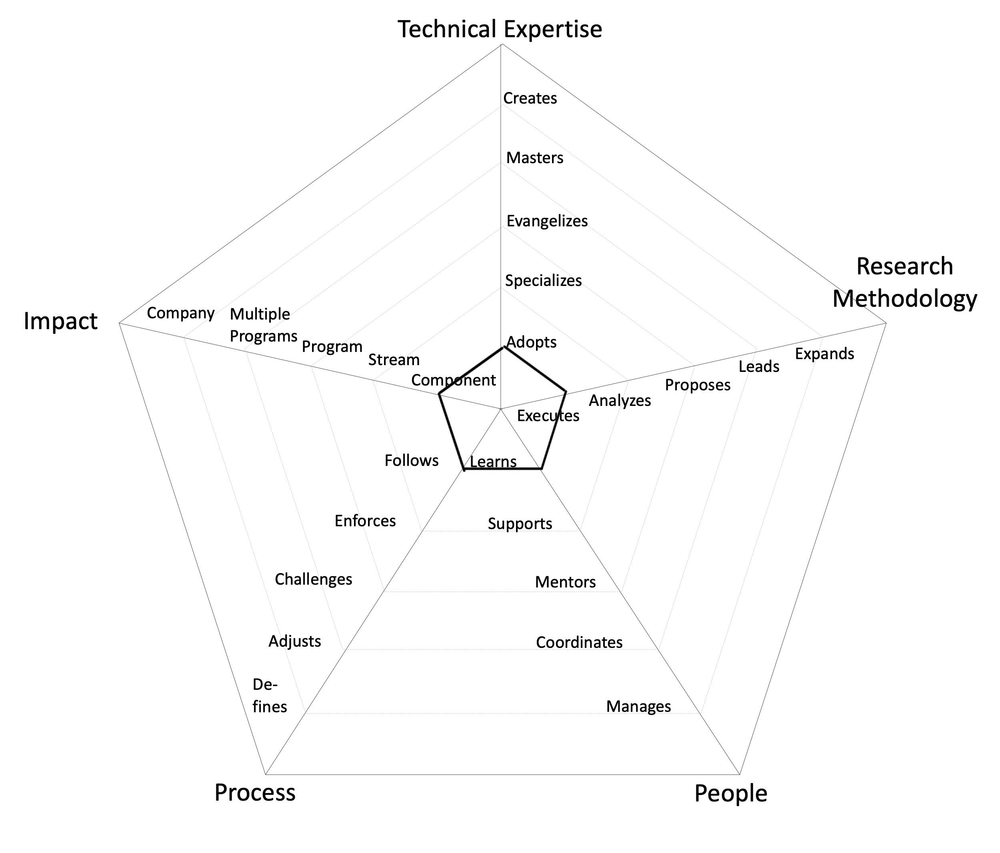

# Research Roles

## Associate Engineer in Research

- **Component**: makes an impact on one or more components of the system
- **Adopts**: actively learns and adopts the architectural approaches and tools defined by the Stream
- **Executes**: Given a research question, knows where to look and gather all state-of-the-art articles and papers and summarize them with good coherency
- **Learns**: quickly learns from others and consistently steps up when it is required
- **Follows**: follows the SDLC processes on a Stream level, delivering a consistent flow of features to production

---

## Engineer in Research

- **Stream**: makes an impact on the whole Stream, not just on specific parts of it
- **Specializes**: is the go-to person for one or more architecture domains and takes initiative to learn new ones
- **Analyzes**: Is able to filter out relevant and high quality papers, articles, projects. Can sufficiently critique the usefulness of the method. Can write longer articles on a topic explaining complex matters in simpler terms
- **Supports**: proactively supports other team members and helps them to be successful
- **Enforces**: enforces the [SDLC](#glossary) processes on a Stream level, making sure everybody understands the benefits and trade offs

---

## Senior Engineer in Research

- **Stream**: makes an impact on the whole Stream, not just on specific parts of it
- **Evangelizes**: researches, creates proofs of concept and introduces new architectural approaches to the Stream
- **Proposes**: Can identify possible research directions, formulates research questions, scopes the research work with tangible outputs. Reviews the work of other team members with an eye for detail. Can write academic style papers, perform systematic literature review and publish it
- **Mentors**: mentors others to accelerate their career-growth and encourages them to participate
- **Challenges**: challenges the SDLC processes on a Stream level, looking for ways to improve them

---

## Principal Engineer in Research

- **Program**: makes an impact not only their Stream but also on other Streams in the Program
- **Masters**: has very deep knowledge about the whole tech stack of the system
- **Leads**: Has the ability to foresee future impediments in any research undertaking. And if it is worth pursuing. Has a sufficient breadth of domain knowledge to facilitate cross-domain research. Leads and helps other team members develop a critical eye for the work
- **Mentors**: mentors others to accelerate their career-growth and encourages them to participate
- **Adjusts**: adjusts the SDLC processes on a Stream level and extends it to other Streams within a Program, listening to feedback and guiding the team through the changes

---

## Distinguished Engineer in Research

- **Multiple Programs**: makes an impact on more than one Programs
- **Creates**: designs and creates new architecture parts that are widely used either by the Streams within or outside the Program
- **Expands**: Pushes the boundaries of fundamental research throughout the community. Veteran and champion known in one or more research domains. Knows the process and importance of high impact publications
- **Coordinates**: coordinates team members providing effective feedback and moderating discussions
- **Defines**: defines the right processes for the Program maturity level, balancing agility and discipline

---
