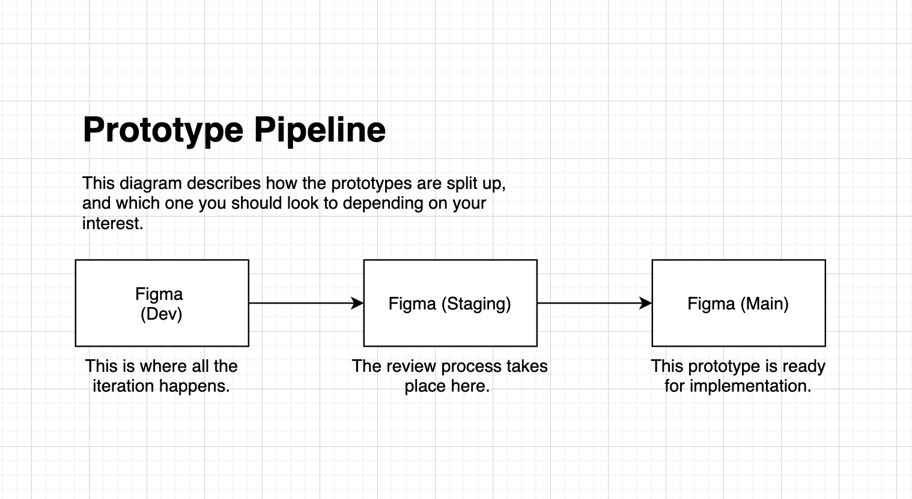

[Back to Table of Contents](../README.md#Table-of-Contents)

# [wip][Front-end] Working with Designers

## Style guides

- Typography (h1, h2..., Body1, Body2..., Button, Caption, misc)
- Color Palette
- Base elements (Form elements, buttons, dropdowns, icons)
- General spacing guidelines
- Error, warning, hover, active state presentations

## Prototypes

