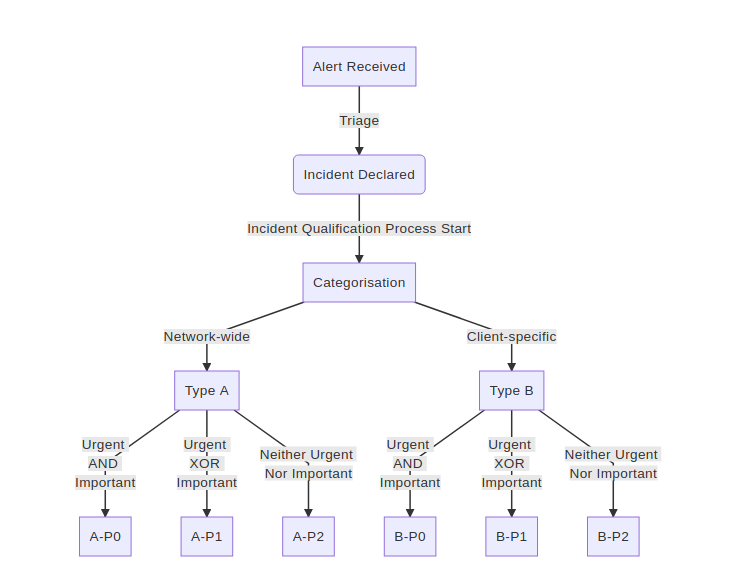

[Back to Table of Contents](../README.md#Table-of-Contents)

# [WIP] ChainSafe Incident Response Pl

# ChainSafe Incident Response Plan

> "Don't wait until you're in a crisis to come up with a crisis plan"

As ChainSafe brings blockchain software to production, we will increasingly be tasked with handling incidents in production.

Responsibly handling incidents as they arise is a critical part of managing production networks.

We should work internally and with external ecosystem stakeholders to have a coherent strategy to respond to emerging incidents, should they arise.

## Proposal

1. ChainSafe SHOULD have a template Project Incident Reponse Plan that may be forked / adopted project-by-project.
2. ChainSafe SHOULD have a company-wide communication entrypoint for incidents, fed to project-specific entrypoints, and/or tied to an alerting system.
3. Every ChainSafe project approaching production (CPAP) MUST have an internal Incident Reponse Plan. Incident Reponse may differ by project, so each project team MUST define what that means for their team.
4. Every CPAP SHOULD attempt to coordinate an Incident Reponse Plan with their respective blockchain ecosystem / network. In many/most cases, blockchain networks contain multiple implementations and stakeholders and so incident management may be more effective if coordinated with outside parties.
5. Every CPAP SHOULD have a predefined alerting system. Incidents may occur at any time. A team contact SHOULD be available to triage / classify an incident no matter when
6. Every CPAP SHOULD have a single communication entrypoint for incidents.
7. Each CPAP SHOULD document incidents as they occur.

## Incident Severity Rating

Incident severity rating follows the *Urgent Important* Matrix:

We therefore define three types of severity, ordered in decreasing criticality.

### P0

An incident is rated P0 if it is "Important" and "Urgent". Examples:

- Consensus split
- Critical vulnerability affecting a specification
- Active exploitation of a BLS vulnerability affecting a library widely used
- 10+ epochs without finality
- \> 25% drop in attestation inclusion
- Denial of service condition causing validators to go offline

### P1

An incident is rated P1 if it is either "Important" or "Urgent". Examples:

- \< 25% drop in attestation inclusion
- P2P network message propagation issues
- Key management incident affecting > 10% of validators

### P2

An incident is rated P2 it is neither "Important" nor "Urgent". Examples:

- Country/region level censorship
- Key management incident affecting < 10% of validators

## Types of Incidents

We define two categories of incidents on blockchain networks

*Note that the categorisation of an incident can potentially change after investigation (a given incident can be declared as network-wide, but investigations might reveal that it is only impacting a particular client. Similarly, for clients with large userbases, a client-specific issue can turn into a network-wide incident).*

### Type A: Network-Wide Incidents

Incidents falling into this category affect a blockchain network as a whole and are not related / tied to a specific implementation. The following non-exhaustive provides examples:

- Loss of finality on the eth2 network (thresholds defined in incident severity rating)
- Eth1 contract deposit bugs
- Eth1 mining censorship
- Consensus split (i.e. clients not agreeing on the same canonical chain)
- Drop in the number of messages on the gossip network exchanged by nodes running different implementations
- Country/region level censorship
- Significant loss of active/online validators (thresholds defined in incident severity rating)
- Significant drop in attestation inclusion (thresholds defined in incident severity rating)
- Key management incident at a large staking pool

*Note that some of these incidents can have a causality relationship (e.g. a loss of finality can result from a drop in the number of online validators, which can be due to a key management incident at a large staking pool)*

### Type B: Client-Specific Incidents

- Resource exhaustion on nodes
- Denial of service conditions
- Endpoint compromise (e.g. exploitation of Remote Code Execution vulnerabilities)
- Specification deviation
- P2P network message propagation issues
- Developer access compromise (i.e. code repository breached to introduce backdoors into releases)
- Attestation inclusion drops

## Incident Qualification Process

Each alert declared as an incident by a CPAP will be qualified following the process outlined below:

- Hackmd Markdown for above diagram

    graph TD
    	A[Alert Received] -->|Triage| B(Incident Declared)
    	B -->|Incident Qualification Process Start| C[Categorisation]
    	C -->|Network-wide| D[Type A]
    	C -->|Client-specific| E[Type B]
        D -->|Urgent   AND   Important| F[A-P0]
        D -->|Urgent   XOR   Important| G[A-P1]
        D -->|Neither Urgent   Nor Important| H[A-P2]
        E -->|Urgent   AND   Important| I[B-P0]
        E -->|Urgent   XOR   Important| J[B-P1]
        E -->|Neither Urgent   Nor Important| K[B-P2]

## Alerting Infrastructure

The purpose of alerting infrastructure is to allow outside triggers (metrics, email, etc) to initiate a timely response to a potential indicent.

TBD Alerting software