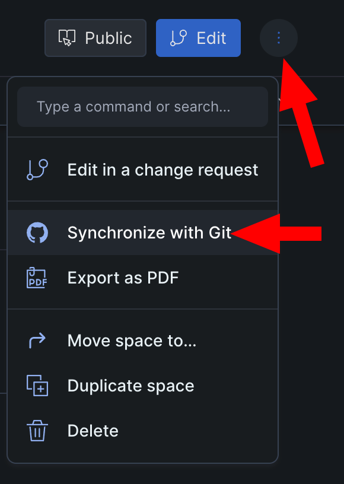

# GitBook migration

This guide describes the process of converting GitBook docs into Docusarus.
Luckily, they are both using Markdown to render content, which makes the process a bit easier.


## 1. Setup Docusaurus Repository

Start by selecting "Import repository" option in GitHub and put the URL of the starter repository (https://github.com/ChainSafe/documentation-starter). Update `docusaurus.config.js` and `package.json` configs with proper naming and urls. 

## 2. Export GitBook Docs to Markdown

You can do this by syncing the GitBook site with GitHub.
Choose the 3 dots icon in the top-right corner of your GitBook site and choose the "Synchronize with GitHub" option.
Connect your GitHub account if you haven't already and select a GitHub repository where you want your GitBook site to export. **Make sure there are no branch protection rules in place and that priority is selected "GitBook to GitHub".**



## 3. Migrate content

Copy all `.md` files from exported GitHub repository into your new Docusarus repository into `/docs` directory.
Delete `SUMMARY.md` file because in Docusaurus it is automatically generated (Read more how to modify sidebar: https://docusaurus.io/docs/sidebar/autogenerated#autogenerated-sidebar-metadata).

If you ran `yarn start` in the new repository you should see your documentation homepage. There will probably be some unsupported markdown features.

## 4. Fix unsupported Markdown features

### Embedded Video or Playlist links

| GitBook | Docusaurus |
| --- | --- |
| `` |  Go to the source (YouTube, Vimeo), choose to share embedded and paste raw html code in markdown |

### Change anchor names

| GitBook | Docusaurus |
| --- | --- |
| `# Heading <a href="#heading2" id="heading2"></a>` |  `# Heading {#heading2}` |

### Description sections to call-outs

| GitBook | Docusaurus |
| --- | --- |
| <code>---<br/>description: >-<br/>---</code> |  <code>:::info<br/><br/>:::</code> |

### Syntax highlight for non-default languages

Docusaurus by default supports only [this set of language highlights](https://github.com/FormidableLabs/prism-react-renderer/blob/master/src/vendor/prism/includeLangs.js). In order to add highlight support for other popular languages `docusaurus.conf.js` needs to be extended with the desired languages list:

```js
themeConfig:
    ...
    prism: {
        ...
        additionalLanguages: ['csharp'],
    }
    ...
```

More information can be found [here](https://docusaurus.io/docs/markdown-features/code-blocks#supported-languages).
### Code blocks line numbering

| GitBook | Docusaurus |
| --- | --- |
| <code>\{\% code lineNumbers="true" \%\}</code> |  <code>showLineNumbers</code> |
