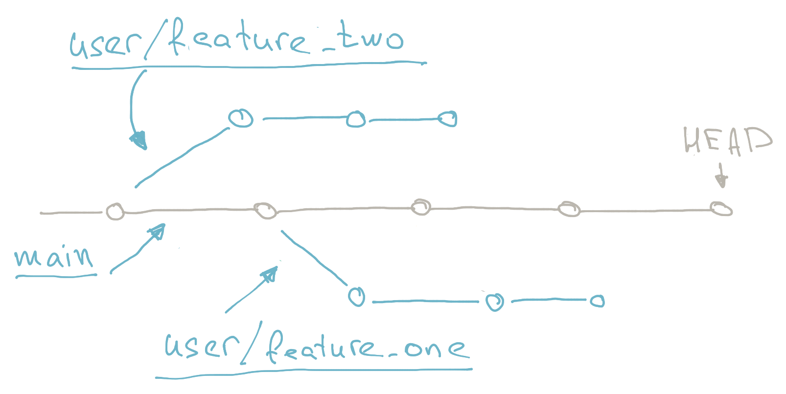
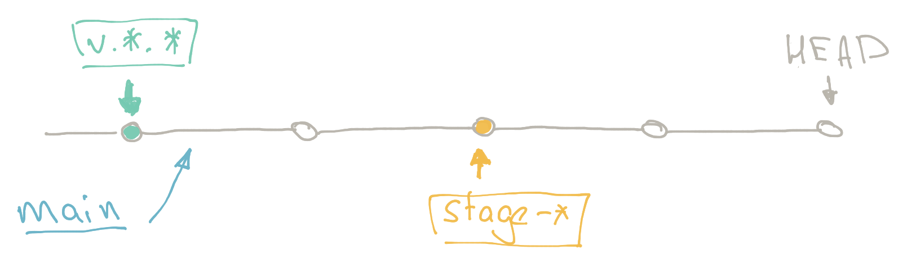
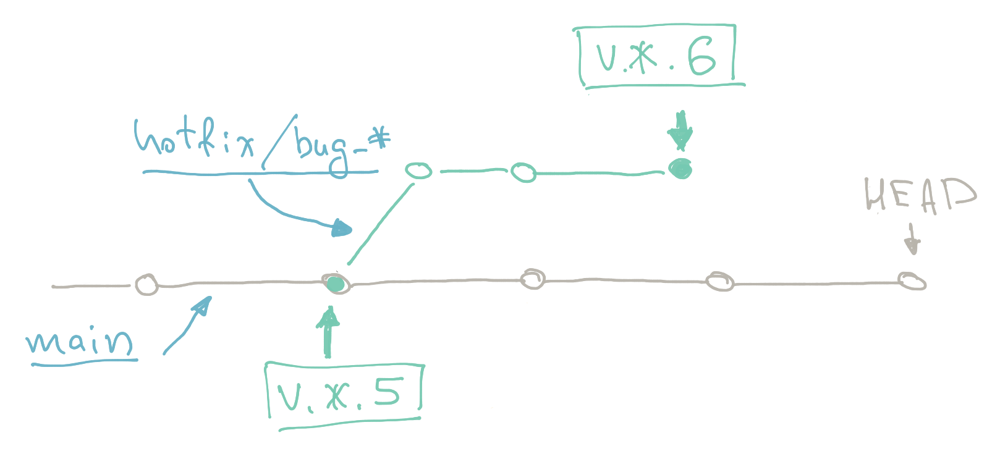

## Overview  
There are multiple ways to deal with branching and CI. The most famous ones are probably [GitFlow](https://www.atlassian.com/git/tutorials/comparing-workflows/gitflow-workflow), [GitHub Flow](https://docs.github.com/en/get-started/quickstart/github-flow) and [Gitlab Flow](https://docs.gitlab.com/ee/topics/gitlab_flow.html). However they are pretty branch heavy and that in it turn brings a lot of back and forth on CI, merging, commit tracking and back-merging.

The approach described below is not ideal and far from being a sliver bullet but its minimalistic design have some advantages, especially in CI/CD-first development cycle.

## Branches
There is a pretty good description of branching rules and naming convention in the [Development](/development/development-flow/development) section of this handbook and we will not repeat it here but just encourage to follow it.

## The branch
The whole OneFlow approach is built around just one branch. In our case `main`. Every other branch is circumstantial and suppose to live only till it got merged to `main`. OneFlow relaying heavily on tags and the fact that tags are global and not related to branch. Plus support for tags in modern CI/CD systems is pretty widespread and full featured.

## Deployments
Multi-environment setup of development process usually assumes 3 general environments: development, staging, production. Markers of staging and production deployments are tags and development is always a `main`  branch `HEAD`.

* Development environment - `HEAD`
* Staging - `tag stage-*`
* Production - `tag v.*.*`

On this illustration branches are underlined and tags put into boxes.

All that approach states nothing about PR-preview deployments or any other additional deployments that are needed for development cycle. Those are established on "on-need" basis.

## Hot fixes of tagged deployments
There are situations when a hot fix is needed. For that purpose a `hotfix/*`  branch can be made. This branch will use broken production tag as a parent commit and as soon as all changes are ready and tested a new `v.*.*` tags can be made which will be picked up by CD to deploy a new version.

