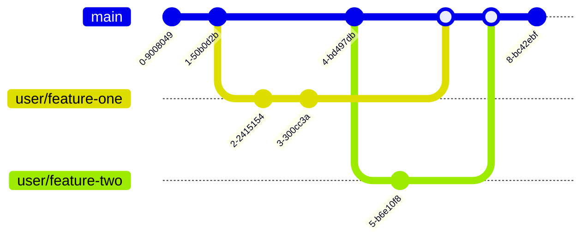
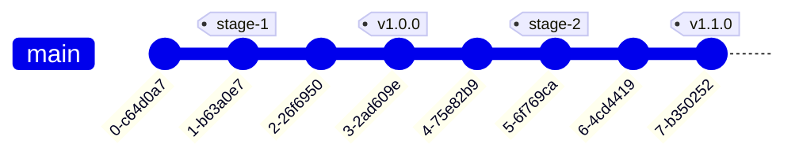
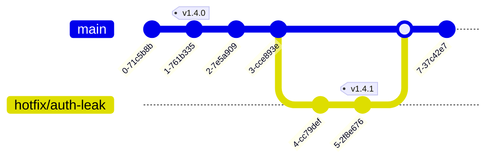

# OneFlow

ChainSafe's branching and release model. Trunk-based, minimalist, tag-driven. Built around a single long-lived branch (`main`) with tags as the deployment markers — everything else is circumstantial and short-lived.

> **In one line:** One branch. Feature branches off it, merged back. Tags drive deployments. No long-lived release branches, no back-merging.

## Why OneFlow

The well-known git workflows — GitFlow, GitHub Flow, GitLab Flow — are branch-heavy. They produce a lot of back-and-forth on CI, merging, commit tracking, and back-merging. That cost compounds in CI/CD-first development cycles, where deployments are frequent and most "what shipped where" answers need to be obvious from the repo state alone.

OneFlow is not a silver bullet. Its strength is its minimalism: one branch, tags for deployments, short-lived everything-else. The trade-off is that some scenarios (long-running parallel release lines, multi-version maintenance) require additional discipline OneFlow doesn't prescribe — but those scenarios are rare at ChainSafe.

This document is the ChainSafe variant of the OneFlow concept (the broader pattern is described by Adam Ruka at [endoflineblog.com](https://www.endoflineblog.com/oneflow-a-git-branching-model-and-workflow); our variant uses specific tag conventions for environments).

## Branches

There is exactly one long-lived branch: **`main`**. Every other branch is short-lived and exists only until merged back into `main`.

### Branch naming

| Pattern | Purpose |
|---|---|
| `<name>/<feature>` (e.g. `alex/add-rate-limiter`, `sam/fix-nonce-bug`) | Personal feature branches. Use your GitHub handle or a consistent identifier as the prefix. Git stores branches with `/` as a directory delimiter (see `.git/refs/heads/`), so this gives every contributor their own namespace. |
| `hotfix/<bug>` (e.g. `hotfix/auth-leak`) | Branches off a broken production tag to ship an emergency fix. See [Hot fixes](#hot-fixes-of-tagged-deployments). |
| `release/<version>` (e.g. `release/v0.23.1-rc`) | Used only for back-porting an earlier release. Most ChainSafe work does not need release branches because tags do the job. |

### Branch diagram

Two feature branches off `main`, both merged back. No long-lived parallel branches.

## Tags as deployment markers

OneFlow leans on tags, not branches, to mark what's deployed where. Tags are global, branch-independent, and well-supported in modern CI/CD systems.

| Environment | Marker |
|---|---|
| **Development** | `HEAD` of `main` |
| **Staging** | `stage-*` tags (e.g., `stage-2026-05-27`, `stage-rc`) |
| **Production** | `v.*.*` semantic-version tags (e.g., `v1.4.0`, `v2.0.0-rc.1`) |

Tag-driven CD pipelines watch for these patterns and deploy automatically. Operators control deployments by *tagging*, not by *merging*.

### Deployment diagram

`main` advances; tags accumulate. The production line is the sequence of `v.*.*` tags. The staging line is the sequence of `stage-*` tags. Development is wherever `HEAD` is right now.

### Preview deployments

PR-preview deployments and other on-demand environments are layered on top as needed — OneFlow doesn't prescribe their shape. Establish them on an on-need basis per project.

### Tag protection

GitHub supports [tag protection rules](https://docs.github.com/en/repositories/managing-your-repositorys-settings-and-features/managing-repository-settings/configuring-tag-protection-rules) — only users with write access can create tags matching protected patterns, and only admins can delete them. Configure these for `v.*.*` and `stage-*` patterns as a security baseline; the tag *is* the deployment authority, so unauthorized tag creation is unauthorized deployment.

See [`repo-and-ci-setup.md` §7](./repo-and-ci-setup.md#7-security-baseline) for the broader security baseline.

## Hot fixes of tagged deployments

When a production tag breaks, you ship a hot fix without waiting for the next planned release:

1. Create a `hotfix/<bug>` branch off the broken production tag (not off `main` — the broken tag is the parent because that's the state you're patching).
2. Land the fix on the hotfix branch. Test it.
3. Tag a new `v.*.*` (typically a patch bump, e.g., `v1.4.0` → `v1.4.1`). CD picks it up and deploys.
4. **Merge the `hotfix/*` branch back into `main`**, then let it flow through the staging environment before the next planned release tag. This is non-negotiable — leaving the fix unmerged means the next release reintroduces the bug.

### Hot-fix diagram

The hot fix is tagged `v1.4.1` directly on the `hotfix/*` branch (it ships from there). After deployment, the branch merges back into `main` so the fix is in trunk for the next release.

## When OneFlow doesn't fit

OneFlow assumes:

- One production line at a time (or, equivalently, the team is willing to handle parallel production lines manually with `release/*` branches).
- Tags are protected and tag-creation is the deployment trigger.
- CI/CD watches the trunk and the tag patterns; there's no separate "release branch CD" pipeline.

When those assumptions break — long-lived parallel release lines (e.g., maintaining v1 and v2 of a public library simultaneously), regulated environments requiring branch-based release artifacts — extend with `release/<version>` branches and treat them as additional trunks. Document the deviation per-project; OneFlow remains the default.

## Relationship to other workflow pages

- [`pr-authoring.md`](./pr-authoring.md) — how to open and ship the feature branches that OneFlow assumes.
- [`code-review.md`](./code-review.md) — how those PRs get reviewed before merging to `main`.
- [`release-and-deploy.md`](./release-and-deploy.md) — the operator decisions wrapped around the actual tag-create-and-deploy step.
- [`repo-and-ci-setup.md`](./repo-and-ci-setup.md) — branch protection on `main`, tag protection for `v.*.*` and `stage-*`, CI baseline that watches the tags.

## Related

- Adam Ruka's original ["OneFlow — a Git branching model and workflow"](https://www.endoflineblog.com/oneflow-a-git-branching-model-and-workflow) — the broader concept this page adapts.
- [`../invariants/engineering-invariants.md`](../invariants/engineering-invariants.md) — the "standards are enforced, not suggested" invariant that branch protection and tag protection make real.
